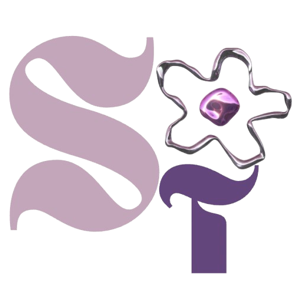

<div align="center" style="background-color:#f6f4f0; padding: 40px 0 20px;">



# Shruti Tokekar
### Developer · Designer · Creative Technologist

[](http://shrutitokekar.com)
[](https://vitejs.dev)
[](https://tailwindcss.com)
[](https://vercel.com)

</div>

---

## About

A clean, modern, and fully responsive personal portfolio built with React + Vite — designed to showcase my work across both engineering and design. The site features a handcrafted cream aesthetic, a crash-animation hero, an interactive terminal, and dual portals for my development and design work.

🌐 **[shrutitokekar.com](http://shrutitokekar.com)**

---

## Features

- **Crash-animation hero** with particle effects and 3D typography
- **Live terminal component** reflecting current stack and projects
- **Dual portals** — separate spaces for design and engineering work
- **Animated contact form** powered by EmailJS, no backend required
- **Smooth page transitions** and hover interactions via CSS animations
- **Fully responsive** across mobile, tablet, and desktop
- **Resume download** served with a forced `Content-Disposition` header via `vercel.json`

---

## Tech Stack

| Layer | Technology |
|---|---|
| Frontend | React.js + Vite |
| Styling | Tailwind CSS + inline styles |
| Routing | React Router |
| Contact Form | EmailJS |
| Deployment | Vercel |

---

## Project Structure

```
src/
├── assets/               # Images and logos
├── components/
│   ├── Hero.jsx          # Crash animation, terminal, portal cards
│   ├── About.jsx         # Timeline, skills accordion, certificates
│   ├── DesignPortfolio.jsx
│   ├── Projects.jsx
│   ├── Contact.jsx
│   ├── Terminal.jsx      # Live terminal component
│   └── Footer.jsx
├── App.jsx               # Main routing and layout
└── main.jsx              # Entry point
public/
└── resume.pdf
vercel.json               # Content-Disposition header for resume download
```

---

## Pages

| Route | Description |
|---|---|
| `/` | Hero with crash animation and terminal |
| `/about` | Timeline, skills accordion, certificates |
| `/design` | UI/UX and web design projects |
| `/projects` | Engineering and development projects |
| `/contact` | Contact form and links |

---

## About Me

**B.S. Computer Science, Minor in Graphic & Web Design**  
East Stroudsburg University · Allentown, PA

I build things that live at the intersection of design and engineering — from biotech marketing sites to interactive portfolios. I care about the details: the animation timing, the type scale, the way a hover feels.

📧 [shrutitokekar@gmail.com](mailto:shrutitokekar@gmail.com)  
🌐 [shrutitokekar.com](http://shrutitokekar.com)  
💻 [github.com/ShrutiTokekar](https://github.com/ShrutiTokekar)  
🔗 [linkedin.com/in/shruti-tokekar](https://linkedin.com/in/shruti-tokekar)

---

<p align="center">
  <sub>© 2026 Shruti Tokekar · All rights reserved.</sub>
</p>
